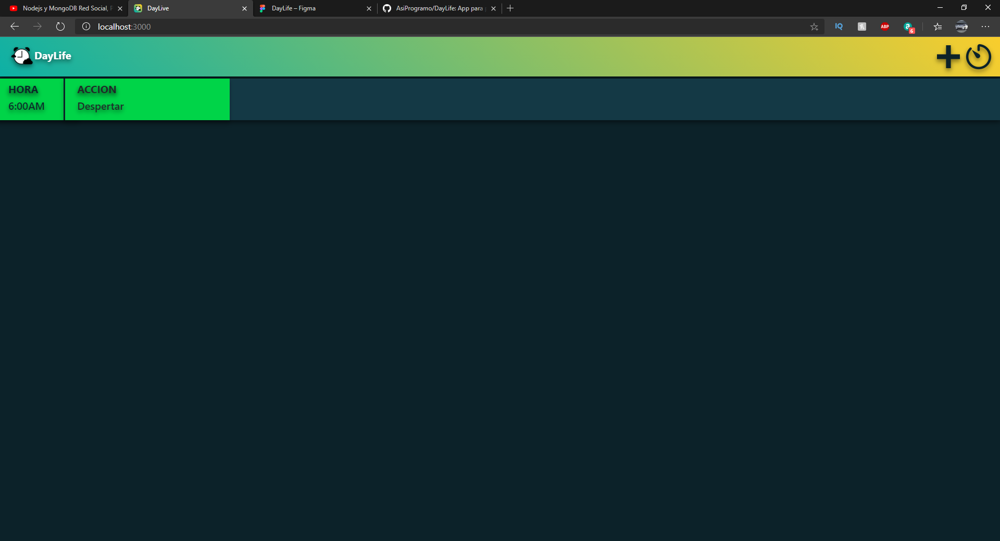

# DayLife
DayLife es un web app en la cual se genera un horario en base a tu hora de despertar para tu productividad y organización personal. También puedes compartir tu estilo de vida con imágenes, las cuales puedes subir, ver, darle me gusta y comentar.



## Funciones
- Registro e inicio de sesión (email + contraseña, guardada con bcrypt).
- Horario del día generado a partir de tu hora de despertar (se guarda en el navegador y se cambia con el botón ✏️).
- Galería de imágenes: subir, ver, me gusta, comentarios y borrar (solo el autor).

## Requisitos
- Node.js 18 o superior
- MongoDB (local, Docker o MongoDB Atlas)

## Cómo ejecutarlo
```bash
npm install
cp .env.example .env        # ajusta MONGODB_URI y SESSION_SECRET
npm run dev                 # o: npm start
```
Abre http://localhost:3000, crea una cuenta en `/crear` e inicia sesión.

¿No tienes MongoDB instalado? Con Docker:
```bash
docker run -d --name daylife-mongo -p 27017:27017 mongo:7
```

## Variables de entorno
| Variable | Por defecto | Descripción |
|---|---|---|
| `PORT` | `3000` | Puerto del servidor |
| `MONGODB_URI` | `mongodb://localhost:27017/DayLife` | Conexión a MongoDB |
| `SESSION_SECRET` | `somesecretkey` | Secreto de la sesión (cámbialo en producción) |
